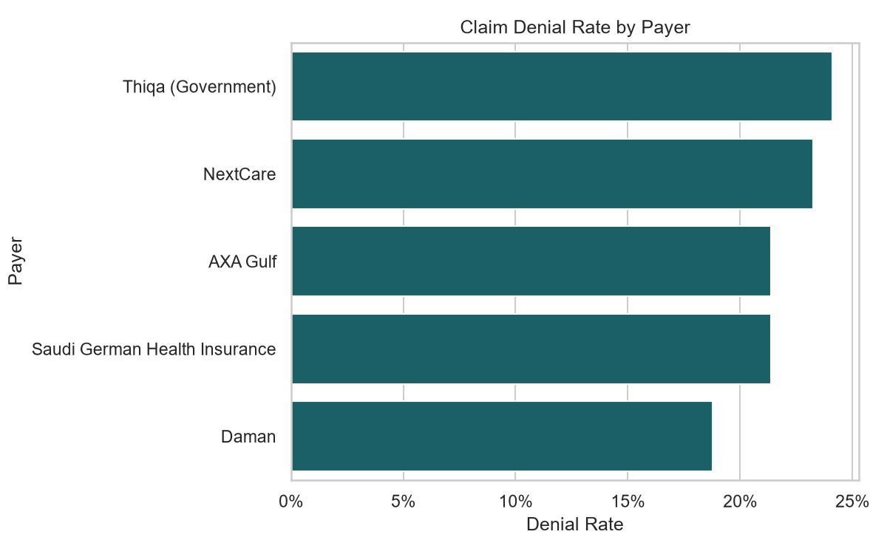
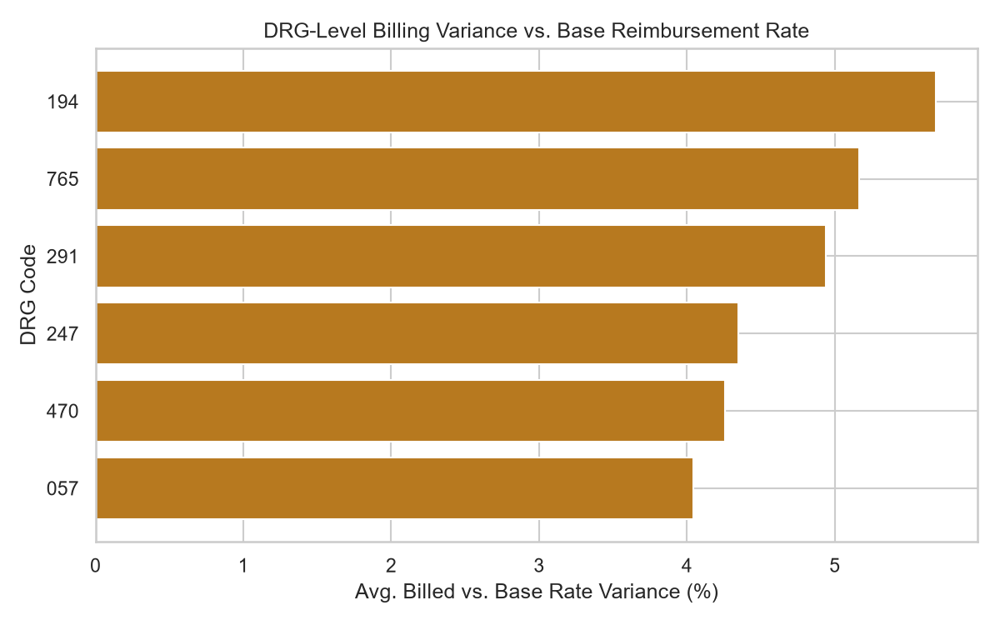
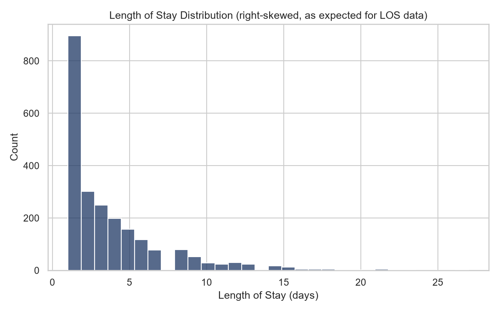

# Hospital RCM & Claims Analytics

An end-to-end healthcare analytics project simulating a hospital's **Revenue Cycle Management (RCM)** pipeline — from patient admission through to claims payment and write-off — with SQL-based KPI analysis, Python statistical testing, and data visualisation.

---

## Overview

Revenue Cycle Management is the process a hospital uses to get paid for the care it provides. This project builds a realistic synthetic dataset modelling that full cycle, then analyses it to answer the kind of questions a hospital analytics team works with daily:

- Which insurance payers are denying the most claims — and why?
- How long does it take to collect payment after a claim is submitted?
- Which patients are being readmitted within 30 days of discharge?
- Are we billing in line with expected DRG reimbursement rates?

---

## Tech Stack

| Tool | Purpose |
|---|---|
| Python (pandas, numpy, faker) | Synthetic data generation |
| SQLite | Analytical database |
| SQL (window functions, CTEs, subqueries) | KPI analysis queries |
| Python (scipy, matplotlib, seaborn) | Statistical testing & visualisation |

---

## Project Structure

```
hospital_rcm_project/
├── generate_data.py          # Builds the synthetic dataset
├── data/
│   ├── patients.csv
│   ├── encounters.csv
│   ├── claims.csv
│   └── claim_events.csv
├── sql/
│   ├── schema.sql            # Data dictionary & table documentation
│   └── analysis_queries.sql  # 7 core RCM analysis queries
├── notebooks/
│   └── analysis.py           # Statistical analysis & charts
├── output/
│   ├── denial_rate_by_payer.png
│   ├── length_of_stay_distribution.png
│   ├── drg_cost_variance.png
│   └── patient_readmission_risk_flags.csv
└── README.md
```

---

## Data Model

Four related tables simulating a real hospital RCM system:

```
patients          (dimension: who the patient is)
    |
    └──< encounters   (fact: each hospital visit)
              |
              └── claims        (fact: insurance bill per encounter)
                      |
                      └──< claim_events  (fact: claim lifecycle events)
```

**Key design decision:** `claim_events` stores every status change as its own row — Submitted → Paid, or Submitted → Denied → Appealed → Paid/Written Off — rather than a single overwriting status column. This preserves the full claim history and enables time-based metrics like Days in Accounts Receivable.

---

## Analyses

### 1. Claim Status Funnel
Identifies the final outcome of every claim using `ROW_NUMBER()` window function to find the latest event per claim.

**Finding:** 88.3% of claims were eventually paid; 11.7% were written off as lost revenue.

### 2. Denial Rate by Payer
Compares denial rates across insurance companies using a correlated `EXISTS` subquery.

**Finding:** Thiqa (Government) had the highest denial rate at 24.1%; Daman the lowest at 18.8%.

### 3. Top Denial Reasons
Breaks down the root causes behind claim denials.

**Finding:** 48% of denials were caused by preventable administrative errors — incorrect patient information, duplicate claims, and coding errors — pointing to a front-end process improvement opportunity.

### 4. Days in Accounts Receivable
Measures average time from claim submission to payment, segmented by payer.

**Finding:** Self-Pay patients took longest at 31.6 days average; Daman was fastest at 22.7 days.

### 5 & 6. 30-Day Readmission Detection
Uses `LAG()` window function to compare each encounter's admission date against the same patient's previous discharge date.

**Finding:** 311 readmissions identified across 2,295 encounters (13.5%). Emergency had the highest readmission rate at 16.5%.

### 7. DRG Cost Variance
Compares average billed amounts against DRG base reimbursement rates across case types.

**Finding:** All DRGs billed approximately 4–5% above base rates on average.

### Statistical Testing
Chi-square test of independence on denial rates across payers.

**Finding:** Differences were not statistically significant at this sample size (p = 0.22) — illustrating that operational patterns can be meaningful even when statistical significance hasn't yet been reached.

### Readmission Risk Flagging
Rule-based patient risk flag (2+ encounters with a prior length of stay > 7 days) as an explainable first-pass approach before building a full predictive model.

---

## How to Run

```bash
# Install dependencies
pip install pandas numpy faker matplotlib seaborn scipy

# Generate synthetic dataset
python generate_data.py

# Run statistical analysis and generate charts
python notebooks/analysis.py

# SQL queries can be run against data/hospital.db
# using DB Browser for SQLite or any SQLite-compatible tool
```

---

## Sample Output

**Denial Rate by Payer**



**DRG Cost Variance**



**Length of Stay Distribution**



---

## Notes

- All data is **fully synthetic** — generated programmatically with realistic statistical patterns (right-skewed length of stay, ~22% denial rate, ~35% readmission probability). No real patient data was used.
- ICD, CPT, and DRG codes used are a small illustrative sample, not the complete official code sets.
- SQLite is used for portability. The SQL is standard and transfers directly to SQL Server, PostgreSQL, Microsoft Fabric, or any cloud warehouse.
